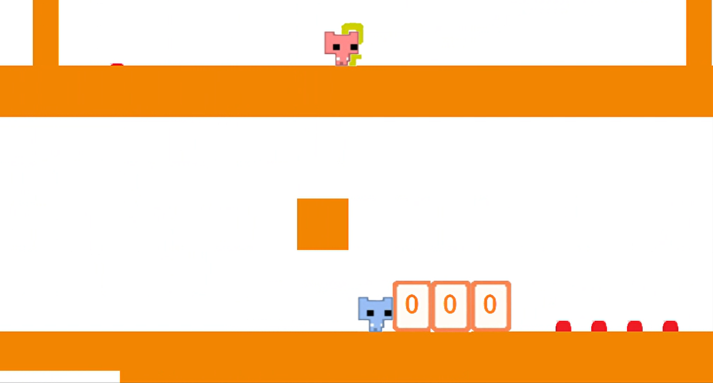

# 2025 OOPL Final Report

## 組別資訊

組別：第四組

組員：黃子臻、林易宣

復刻遊戲：PICO PARK

## 專案簡介

### 遊戲簡介

《PICO PARK》是日本獨立遊戲工作室TECOPARK開發及發行的一款動作解謎遊戲。Microsoft Windows版2016年發行，任天堂Switch版2019年發行；兩版本遊戲機制大致相同，但內容和模式上有所區別。

這款遊戲的獨特之處在於其核心的雙人合作模式。玩家必須與隊友緊密配合，才能克服單人無法通過的地形、移動需要特定人數的方塊，以及操作升降裝置等機關。最終目標是兩人皆取得鑰匙並抵達終點，方能順利通關。這種設計不僅考驗著玩家的默契與戰略思維，更在於享受與朋友共同面對挑戰、克服困難的樂趣與成就感。

### 組別分工

黃子臻:物件邏輯、角色與角色的關係、角色與物件的關係、物件與物件的關係、關卡間的關係。

林易宣:地圖、地圖與物件的關係、畫面設定、報告。

## 遊戲介紹

### 遊戲規則

玩家合作移動pico，皆取得鑰匙並兩人皆抵達終點即可通關。

Pico:使用W鍵(跳)、A鍵(向左)、D鍵(向右)來控制。

Pico: 使用上鍵(跳)、左鍵(向左)、右鍵(向右)來控制。

門:pico取得鑰匙，碰到門後，門變成，pico與門產生碰撞後，按向上(W鍵及上鍵)即可通關。

鑰匙:用於開門，pico取得後，可用於開門。

按鈕:pico踩過或是磚塊壓過後，可移動特定方塊，分為暫時及永久，有的方塊在物體離開按鈕後會恢復原狀，有些壓過即永恆。

特殊方塊:pico接觸數需達到方塊上的數字，方塊才能移動或是動作。

### 操控

分別使用（W鍵、A鍵、D鍵）、(上鍵、左鍵、右鍵）來控制pico的上左右。

使用enter鍵來切到下一頁。

通關後，按enter鍵可以離開關卡。

在關卡中，按enter可離開該關卡至下一關。

### 遊戲畫面

## 程式設計

### 程式架構

- App.hpp / AppStart.cpp / AppUpdate.cpp / AppEnd.cpp
  - 遊戲應用程式的主要類別
  - 管理遊戲生命週期（初始化、更新、結束）
  - 整合所有遊戲組件和系統
  - 處理遊戲狀態和階段轉換
  - 實現碰撞檢測和物理互動邏輯
- AppUtil.hpp / AppUtil.cpp
  - 提供遊戲應用程式的輔助功能
  - 實現任務驗證和階段轉換邏輯
  - 處理特殊遊戲事件和條件檢查
  - 管理遊戲視角和視野範圍
  - 實現相機跟隨角色的邏輯
- Object.hpp / Object.cpp
  - 定義基礎遊戲物件類別
  - 實現物件的位置、大小、速度控制
  - 提供碰撞檢測和位置校正功能
  - 管理物件的繪圖資源和可見性
- Character.hpp / Character.cpp
  - 繼承自 Object 類別，專門處理可控角色
  - 實現角色移動、跳躍和互動邏輯
  - 管理角色狀態（如地面狀態、移動狀態）
  - 處理角色間的碰撞檢測
- AnimatedCharacter.hpp / AnimatedCharacter.cpp
  - 繼承自 Character 類別，增加動畫功能
  - 管理角色的不同動畫狀態和幀
  - 實現角色動畫的更新和切換
- Camera.hpp / Camera.cpp
  - 處理相機邊界限制
- BackgroundImage.hpp
  - 處理遊戲背景圖像
  - 提供背景圖層管理
- PhaseResourceManger.hpp / PhaseManager.cpp
  - 管理不同遊戲階段的資源加載和釋放
  - 控制遊戲階段轉換
  - 提供階段相關資源的訪問接口
- main.cpp
  - 程式的入口點
  - 創建遊戲應用程式實例
  - 啟動遊戲

### 程式技術

- Object 系統繼承結構
  - Object 類別作為基礎遊戲物件
  - Character 繼承自 Object，提供pico基本行為（位置、大小、碰撞）。
  - AnimatedCharacter 繼承自 Character，提供動畫施作。
  - Board、Key、Door 等從 Object 繼承並實作特定功能。
- 模組化設計
  - 將不同功能分離到不同的類別中（Camera, Object, Character 等）
  - 使用單獨的檔案管理不同的功能模組
- 資源管理
  - PhaseResourceManger 負責管理不同遊戲階段間的切換。
  - ValidTask負責管理不同遊戲階段的資源。
- 互動與事件系統
  - 碰撞偵測：使用 AABB 碰撞檢測 (CheckCollision)來判斷物件是否重疊。
  - 互動:透過 Interact()實現封裝及物件間的協作

## 結語

### 問題與解決方法

這是在實作的過程中，遇到了許多問題，還好在組員的齊心協力加上同學們的幫助下順利完成的計劃。

首先，因為組員們對於GitHub 都不是很熟悉，所以一開始我們就花了大量時間在了解如何使用GitHub的分支建立與融合，以及雙方該如何共同管理編輯我們的專案頁面且成功更新各自的進度，這樣的多方嘗試以及助教協助下，我們才能成功的在GitHub上融合同步各自所完成的進度。

第二個是畫面與地圖的連動，因為我們的遊戲需要將畫面範圍跟隨著角色移動而移動，並且將帶出後面會出現的物件一一呈現，原本想要畫出全部的地圖，再用小範圍的鏡頭去照射角色與地圖的關係，但是因為這樣涉及大座標跟小座標的轉換及連動實在過於複雜。所以後來改成讓直接讓地圖反向移動到左右兩端再特殊處理，來完成地圖部分。

### 自評

| 項次 | 項目                   | 完成 |
|------|------------------------|-------|
| 1    | 這是範例 |  V  |
| 2    | 完成專案權限改為 public |  V |
| 3    | 具有 debug mode 的功能  |  V  |
| 4    | 解決專案上所有 Memory Leak 的問題  |  V |
| 5    | 報告中沒有任何錯字，以及沒有任何一項遺漏  |  V  |
| 6    | 報告至少保持基本的美感，人類可讀  |  V |
### 心得

黃子臻:

這次課程讓我深入了解物件導向的應用方式，透過實作地圖設置、角色控制與物體碰撞等功能，更加熟悉類別與物件之間的關係，實作過程中不僅提升了程式設計能力，也學會如何將抽象概念具體化。

林易宣:

我覺得物件導向實習課程讓我更加深刻了解物件導向的實作與運用，以及問題解決與發現問題的能力，也學習到了在專案中如何與他人的協作以及如何分工可以更加順利進行計畫。

### 貢獻比例

黃子臻:60%

林易宣:40%
